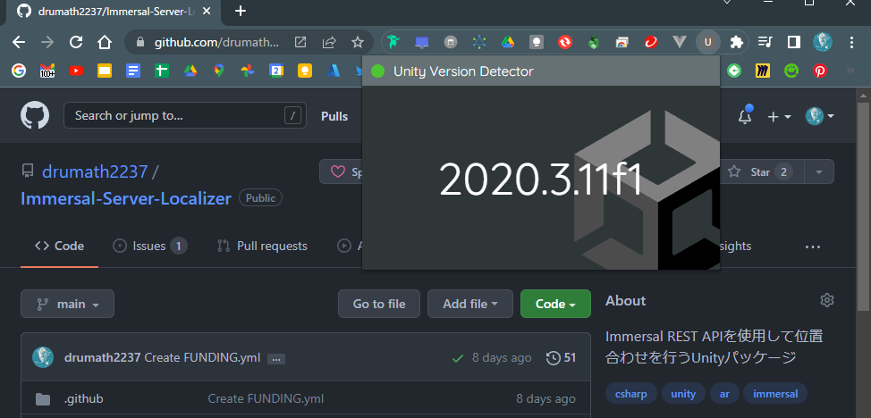

# Unity Version Detector for GitHub



## About

GitHub で閲覧している Unity プロジェクトが使用しているエディタバージョンを教えてくれる Chrome 拡張機能です。
個人的に欲しいと思ったので作りました。

Unity プロジェクトルートディレクトリに移動して起動すると、
`ProjectVersion.txt`から情報を取得して表示します。

**Public なリポジトリでのみ動作します。**

## Tested Environment

- Windows 10 Home
- Chrome 100
- Vite
- TypeScript
- Node v14

## Install & Build

```bash
# install
yarn install

# build
yarn build
```

`/dist`以下に成果物が生成されます。
続いて[`chrome://extensions`](chrome://extensions)を Google Chrome で開き、
dist フォルダを選択して拡張機能として読み込みます。

## Contact

何かございましたら[にー兄さんの Twitter](https://twitter.com/ninisan_drumath)
までよろしくお願いいたします。
